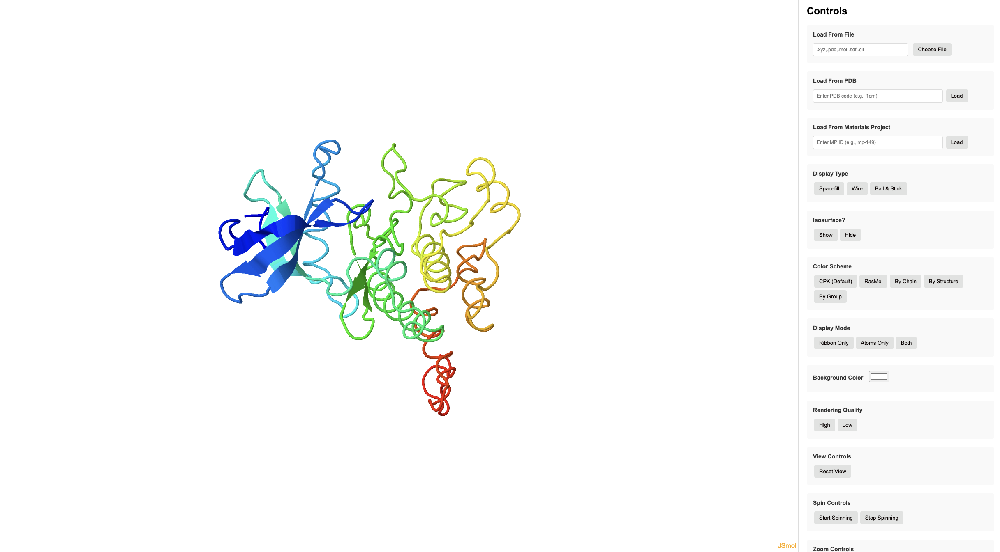

# MolView

A simple 3D viewer for all kinds of molecules, built on top of [JSMol](https://jmol.sourceforge.net/). Accessible at https://atomicarchitects.com/MolView/.



Some supported features:
- Load molecules from the [RSCB Protein Data Bank (PDB)](https://www.rcsb.org/), [Materials Project](https://next-gen.materialsproject.org/) and [NIH PubChem](https://pubchem.ncbi.nlm.nih.gov/), with no API keys needed.
- Manipulate atomic geometries (highlight/delete/color atoms).
- Save screenshots (as `.png`) and structures (as `.xyz`, `.pdb`, `.mol`, `.sdf`, `.cif`).

## How to run locally?

```bash
git clone https://github.com/atomicarchitects/MolView.git
cd MolView
python -m http.server 8000
```

and then navigate to http://localhost:8000/.

### For Materials Project

We have a setup a proxy server via Google Cloud Run to query the Materials Project via OPTIMADE (no API key required).

If you want to run your own proxy server, check out https://github.com/ameya98/mp-proxy.
```bash
git clone https://github.com/ameya98/mp-proxy.git
cd mp-proxy
uv venv
source .venv/bin/activate
uv pip install -r requirements.txt
python mp-proxy/proxy.py
```
Then, update `MP_PROXY_SERVER` in `index.html` to match the proxy server URL (eg. http://localhost:5001).
You can then query the Materials Project with MolView.
